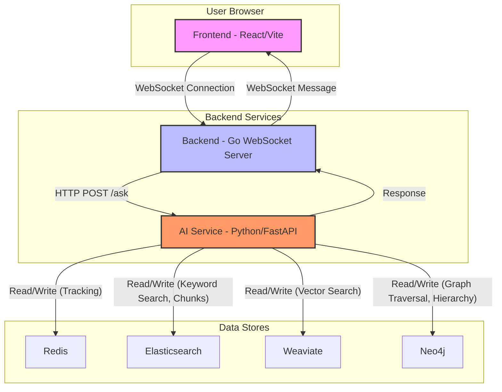
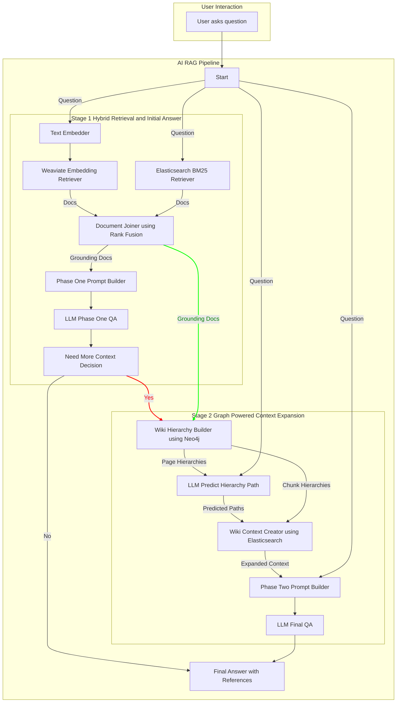

# Tinker: A Multi-Modal RAG Exploration Platform

Tinker is a full-stack application designed to explore advanced concepts in Retrieval-Augmented Generation (RAG). It features a two-stage, multi-hop RAG pipeline that leverages a hybrid of search techniques (keyword, semantic, and graph-based) to answer complex questions about a large corpus of data—in this case, a subset of Wikipedia.

The system is composed of three main parts:
1.  **AI Service (`ai/`)**: A Python backend built with Haystack and FastAPI that performs data ingestion, indexing, and the complex two-stage question-answering.
2.  **Backend (`be/`)**: A lightweight Go WebSocket server that acts as a bridge between the frontend and the AI service.
3.  **Frontend (`fe/`)**: A responsive React/TypeScript single-page application that provides the user interface for chatting with the AI and viewing information on a map.

## Architecture & Workflow

The architecture is designed to decouple the user interface from the heavy-lifting AI processing. The Go backend serves as a simple message broker, while the Python service encapsulates all the complex RAG logic and database interactions.

### High-Level Architecture Diagram



### Core Workflows

There are two primary workflows in the system: the one-time **Data Indexing Workflow** and the runtime **Question Answering Workflow**.

#### 1. Data Indexing Workflow

This process downloads, chunks, and indexes Wikipedia content into the various databases. The entry point is `ai/wiki/index/main.py`.

**Execution Flow:**

1.  **Initialization (`main.py`)**:
    *   Sets up logging and initializes resources: Redis, Weaviate, Elasticsearch, and a Neo4j driver.
    *   Reads configuration from `config.yml`, including the root category (e.g., "Dinosaurs"), data filepaths, and exclusion keywords.
2.  **Download (`Downloader`)**:
    *   The `fetch_wiki_data` function is called recursively.
    *   For a given category, it uses the Wikipedia API to get a list of member pages and subcategories (`get_wiki_category_members`).
    *   It filters out unwanted pages/categories based on `exclude_keywords`.
    *   It downloads the HTML content of each page (`download_page`).
    *   It uses **Redis** to keep track of already downloaded pages and categories to avoid redundant work.
3.  **Chunk (`Chunker`)**:
    *   The `chunk_wiki_data` function processes the downloaded HTML files.
    *   It uses a custom Haystack component, `WikiPageChunker` (`ai/lib/wiki/index/chunk/wiki_page_chunker.py`). This is a key component that:
        *   Parses the HTML, splitting it into text chunks (based on `<p>`, `<li>` tags).
        *   Simultaneously creates a JSON object representing the page's structural hierarchy (e.g., `Page -> H2 Section -> H3 Section`).
        *   Assigns a unique UUID to each chunk.
    *   The chunked documents and the hierarchy JSON are saved to the `.metadata/chunk` directory.
4.  **Index (`Indexer`)**:
    *   The `index_wiki_data` function orchestrates writing the chunked data to the three databases.
    *   **Elasticsearch**: The raw text chunks are written to Elasticsearch for fast, full-text (BM25) search via `ElasticsearchDocumentStore`.
    *   **Weaviate**:
        *   An `OpenAIDocumentEmbedder` creates vector embeddings for each chunk.
        *   The chunks, now enriched with embeddings, are written to Weaviate for semantic/vector search via `WeaviateDocumentStore`.
    *   **Neo4j**:
        *   `Neo4jPageGraphCreator` reads the hierarchy JSON file for each page. It translates this structure into a detailed graph, creating `Page`, `Section` (with `h2`, `h3`, `h4` labels), and `Chunk` nodes. It connects them with relationships like `:HAS_SECTION`, `:NEXT_SECTION`, `:FIRST_CHUNK`, and `:NEXT_CHUNK` to preserve order and structure.
        *   `Neo4jCategoryGraphCreator` then adds another layer, connecting `Category` nodes to their respective `Page` and sub-`Category` nodes.

#### 2. Question Answering (RAG) Workflow

This is the core two-stage RAG pipeline, orchestrated by `ai/wiki/rag/main.py` and implemented in `ai/wiki/rag/question_answer_async.py`.



**Execution Flow:**

1.  **Request (`fe/web/src/components/Argonk.tsx` -> `be/.../main.go` -> `ai/.../main.py`)**:
    *   User types a question in the `Argonk` chat interface and clicks send.
    *   The React component sends the prompt over a WebSocket to the Go backend.
    *   The Go backend forwards the question via an HTTP POST request to the FastAPI endpoint `/ask` on the AI service.

2.  **Stage 1: Hybrid Retrieval**:
    *   The `ask` function in `question_answer_async.py` is invoked.
    *   The question is simultaneously sent to two retrievers:
        *   `OpenAITextEmbedder` -> `WeaviateEmbeddingRetriever`: For semantic search.
        *   `ElasticsearchBM25Retriever`: For keyword search.
    *   `DocumentJoiner`: The results from both retrievers are merged and re-ranked using "reciprocal rank fusion" to get the best initial set of document chunks (grounding docs).
    *   `PromptBuilder` & `OpenAIGenerator` (Phase 1 LLM): These grounding docs are formatted into a prompt (using `phase_1_qa.py` template) and sent to the LLM. The prompt explicitly asks the LLM to answer the question *and* determine if the context is sufficient, returning a structured JSON response conforming to the `Phase1QA` Pydantic model.

3.  **Decision Point**:
    *   The system parses the LLM's JSON response.
    *   If `need_more_context` is `false`, the answer is considered complete. The workflow jumps to the end, formatting the response with references.
    *   If `need_more_context` is `true`, the system proceeds to Stage 2.

4.  **Stage 2: Graph-Powered Context Expansion**:
    *   `WikiHierarchyBuilder`: Takes the grounding docs from Stage 1. For each unique page title in those docs, it queries **Neo4j** to reconstruct the full section hierarchy of that page.
    *   `PromptBuilder` & `OpenAIGenerator` (Hierarchy Predictor LLM): The reconstructed hierarchies and the original question are sent to the LLM (using the `phase_2_hierarchy.py` template). This LLM's sole job is to predict which path within the hierarchy (e.g., `["Dinosaur", "Paleobiology", "Size"]`) is most likely to contain the answer. It returns this path in a structured JSON format (`HierarchyPathData` model).
    *   `WikiContextCreator`:
        *   Takes the predicted path(s) from the LLM.
        *   For each path, it navigates the corresponding `chunks_hierarchy` to find all the chunk UUIDs under that path.
        *   It then fetches the full content of these chunks from **Elasticsearch** (using `document_store.filter_documents`).
        *   It assembles these chunks into a single, structurally coherent block of text, creating a highly relevant and expanded context.
    *   `PromptBuilder` & `OpenAIGenerator` (Final QA LLM): This expanded context is used to build a final prompt (using `phase_2_qa.py` template). The LLM generates the final, comprehensive answer based on this rich context, again providing document IDs for citation.

5.  **Response (`ai/...` -> `be/...` -> `fe/...`)**:
    *   `build_answer_with_reference`: The final JSON answer is processed. The document IDs are used to look up the metadata (title, h2, h3, etc.) of the source chunks.
    *   The final payload, containing the answer text and a list of structured references, is sent back to the Go backend, which relays it to the frontend via WebSocket.
    *   `Argonk.tsx`: The `onmessage` handler parses the response. It uses the reference metadata to construct clickable Wikipedia URLs (`https://en.wikipedia.org/wiki/Page_Title#Section_Name`) and displays the answer and references to the user.

## Codebase Structure

### `ai/` - AI Service (Python)

*   **`wiki/index/`**: The data ingestion and indexing pipeline.
    *   `main.py`: Entry point for the entire indexing process.
    *   `downloader.py`: Handles downloading Wikipedia pages.
    *   `chunker.py`: Orchestrates the chunking process.
    *   `indexer.py`: Orchestrates writing data to the three databases.
*   **`wiki/rag/`**: The question-answering RAG pipeline.
    *   `main.py`: FastAPI entry point, initializes pipelines and resources.
    *   `question_answer_async.py`: Core asynchronous implementation of the two-stage RAG logic.
*   **`lib/wiki/`**: Reusable components and helpers for the `ai/` service.
    *   **`index/chunk/`**: Logic for chunking. `wiki_page_chunker.py` is the custom Haystack component.
    *   **`index/download/`**: Helpers for the downloader.
    *   **`index/graph/`**: `page_graph_creator.py` and `category_graph_creator.py` contain the logic for building the Neo4j graph.
    *   **`rag/components/`**: Custom Haystack components for the RAG pipeline, like `wiki_hierarchy_builder.py` and `wiki_context_creator.py`.
    *   **`rag/helpers/`**: Utility functions for RAG, e.g., processing hierarchies.
    *   **`rag/models/`**: Pydantic models (`Phase1QA`, `Phase2QA`, etc.) for structured LLM input/output.
    *   **`rag/pipelines/`**: Defines the Haystack `Pipeline` objects for the hybrid and graph stages.
    *   **`rag/templates/`**: Contains the large, detailed prompt templates for the LLMs.
*   **`config.yml`**: Central configuration for filepaths, model names, API endpoints, etc.
*   **`docker-compose.databases.yml`**: Defines the four backing data services.

### `be/` - Backend (Go)

*   **`chat/cmd/ws/main.go`**: A single-file application that:
    *   Creates a WebSocket server at `/ws`.
    *   Listens for incoming messages from the frontend.
    *   Forwards these messages as HTTP POST requests to the Python AI service.
    *   Receives the HTTP response and sends it back to the frontend over the WebSocket.

### `fe/` - Frontend (React)

*   **`src/`**:
    *   `App.tsx`: The main layout component, splitting the screen between `Knogra` and `Argonk`.
    *   **`components/Argonk.tsx`**: The main chat interface. It manages the WebSocket connection, handles user input, displays the conversation history, and crucially, parses the AI's response to create clickable reference links.
    *   `main.tsx`: The entry point for the React application.

## Setup & Installation

1.  **Prerequisites**:
    *   Docker and Docker Compose
    *   Python 3.10+ and pip
    *   Go 1.23+
    *   Node.js and npm/yarn

2.  **Configuration**:
    *   Navigate to the `ai/` directory.
    *   Copy `.env.sample` to `.env` and fill in your `NEO4J_PASSWORD` and `OPENAI_API_KEY`.
    *   Open `ai/config.yml` and verify the filepaths under `index.filepath`, `rag.log_filepath`, etc., match your system's directory structure.
    *   Open `ai/docker-compose.databases.yml` and ensure the `device` paths for the volumes point to valid directories on your host machine where you want to store the database data.

3.  **Launch Databases**:
    From the `ai/` directory, start all data services:
    ```sh
    docker compose -f docker-compose.databases.yml up -d
    ```

4.  **Install AI Dependencies**:
    From the `ai/` directory, create a virtual environment and install packages:
    ```sh
    python -m venv venv
    source venv/bin/activate
    pip install -r requirements.txt # (Assuming a requirements.txt exists, otherwise install from imports)
    ```

5.  **Install Backend Dependencies**:
    From the `be/chat/` directory:
    ```sh
    go mod tidy
    ```

6.  **Install Frontend Dependencies**:
    From the `fe/web/` directory:
    ```sh
    npm install
    ```

## Usage

You need to run each part of the stack in a separate terminal.

1.  **Run the Indexing Pipeline (One-time setup)**:
    From the `ai/` directory (with the virtual environment activated):
    ```sh
    python wiki/index/main.py
    ```
    This will take a significant amount of time as it downloads, chunks, and indexes thousands of pages.

2.  **Start the AI RAG Service**:
    From the `ai/` directory (with the virtual environment activated):
    ```sh
    fastapi dev wiki/rag/main.py
    ```
    This will start the FastAPI server, typically on `http://localhost:8000`.

3.  **Start the Go WebSocket Backend**:
    From the `be/chat/` directory:
    ```sh
    go run ./cmd/ws/main.go
    ```
    This will start the WebSocket server, typically on `localhost:8080`.

4.  **Start the React Frontend**:
    From the `fe/web/` directory:
    ```sh
    npm run dev
    ```
    This will start the Vite development server and open the application in your browser, typically at `http://localhost:5173`. You can now interact with the chat interface.